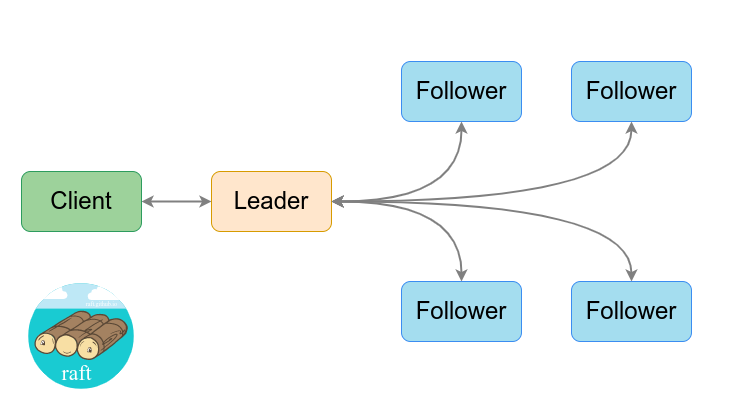

# etcd-pi


## Introduction

In this tutorial we'll be creating an etcd v3 cluster using three Raspberry Pi 4's. From our host machine (in this case Ubuntu 22.04 LTS) we'll bootstrap the cluster using an [Ansible playbook](https://docs.ansible.com/ansible/latest/playbook_guide/playbooks_intro.html), read and write data to the etcd database using `curl` and `Postman`, and finally we'll write a simple [Go](https://go.dev/) application.

## etcd v3

[etcd](https://github.com/etcd-io/etcd) is a distributed key-value store written in the Go language and provides a reliable way to store data across a cluster of machines. It uses the [Raft](https://raft.github.io/) consensus algorithm and is commonly used as a backing store for service discovery and configuration management. It is the basis for distributed systems such as [Kubernetes](http://kubernetes.io/), [locksmith](https://github.com/coreos/locksmith), [vulcand](https://github.com/vulcand/vulcand), [Doorman](https://github.com/youtube/doorman), and many others. etcd is designed to be highly available and consistent, meaning that it allows clients to always read the most up-to-date data, even in the face of network partitions or other failures.



In etcd v3 data is stored in a hierarchical structure called a "prefix tree" (or "patricia trie"). This allows for more efficient data access and more advanced features such as range queries and atomic transactions. Clients access this data using the [gRPC](https://grpc.io/) protocol, which provides a more efficient and flexible way to communicate with the etcd server.


In etcd, [mTLS](https://www.cloudflare.com/learning/access-management/what-is-mutual-tls/), or mutual TLS, is used to ensure that only authorized clients are able to access the etcd cluster and modify its data. Each client and server must have a certificate to participate in the secure communication, ensuring that only authorized clients can access the cluster.


## Raspberry Pi 4


In our demo we'll be using Raspberry Pi 4 hardware for our etcd cluster. etcd developers recommend the use of fast storage, such as SSDs, because etcd is a distributed key-value store that relies on low-latency disk access for many of its core operations. While the Raspberry Pi does not offer SSDs as a type of storage option, it will be fine as a working test-bench for our etcd cluster, just be sure to use a class 10 or higher sd card.

While Raspberry Pi hardware has suffered from "supply chain hell" it seems things should be [improving next year](https://www.raspberrypi.com/news/supply-chain-update-its-good-news/).

## Raspberry Pi Imager

We will use the [Raspberry Pi Imager](https://www.raspberrypi.com/software/) to install the Raspberry Pi OS onto each of our machines. We will use the following settings:


- Operating System: `Raspberry Pi OS (64-bit)`
- Set hostname: `etcd1.local` / `etcd2.local` / `etcd3.local`
- Enable SSH
  - ✓ Use password authentication
- Set username and password
  - Username: `pi`
  - Password: `raspberry`
- Configure wireless LAN
  - SSID: `<SSID>`
  - Password: `<password>`

## ssh

Now we need to create our RSA keys so we can ssh into our Raspberry Pi clients. This will also allow Ansible access to the machine via ssh.

```sh
$ ssh-keygen -t rsa -b 4096 -C "admin@etcd.local"
Generating public/private rsa key pair.
Enter file in which to save the key (/home/bbaker/.ssh/id_rsa): /home/bbaker/.ssh/etcd_id_rsa
Enter passphrase (empty for no passphrase):
Enter same passphrase again:
$ ssh-add ~/.ssh/etcd_id_rsa
Identity added: /home/bbaker/.ssh/etcd_id_rsa (admin@etcd.local)
$ cat ~/.ssh/etcd_id_rsa.pub
$ ssh-copy-id -i ~/.ssh/etcd_id_rsa.pub pi@etcd1.local
$ ssh-copy-id -i ~/.ssh/etcd_id_rsa.pub pi@etcd2.local
$ ssh-copy-id -i ~/.ssh/etcd_id_rsa.pub pi@etcd3.local
```

You should now be able to ssh into each of the three machines from your host:

```sh
$ ssh pi@etcd1.local
$ ssh pi@etcd2.local
$ ssh pi@etcd3.local
```

## Configuring the Cluster

Now you're ready to download some scripts from your host machine to bootstrap the cluster:

```sh
$ git clone https://github.com/benbaker76/etcd-pi.git
$ cd etcd-pi
```

We need to assign some static IPs' to our machines. The defaults in this demo are `192.168.0.50`, `192.168.0.51` and `192.168.0.52`. You may need to change these for compatiblity with your network. Edit the `hosts.ini` file and change to the appropriate values.

```sh
$ nano hosts.ini
```

```ini
[nodes]
etcd1.local ansible_host=192.168.0.50
etcd2.local ansible_host=192.168.0.51
etcd3.local ansible_host=192.168.0.52

[all:vars]
ansible_python_interpreter=/usr/bin/python3
interface=wlan0
routers=192.168.0.1
domain_name_servers=1.1.1.1
cacert_file=/etc/etcd/pki/ca.pem
cert_file=/etc/etcd/pki/etcd.pem
cert_key=/etc/etcd/pki/etcd-key.pem
data_dir=/var/lib/etcd-data
cluster=etcd1.local=https://192.168.0.50:2380,etcd2.local=https://192.168.0.51:2380,etcd3.local=https://192.168.0.52:2380
cluster_state=new
token=etcd-cluster-1
```

## Ansible Playbooks

Here are the Ansible playbooks used in this project (you should not have to modify these). Please ensure you have successfully installed Ansible on your host machine first by following the Ansible installation instructions [here](https://docs.ansible.com/ansible/latest/installation_guide/intro_installation.html).

- certs.yml

```yaml
- hosts: localhost
  tasks:
    - name: create private folder
      file:
        state: directory
        path: private

    - name: create certs folder
      file:
        state: directory
        path: certs

    - name: generate ca.pem
      command: openssl req -x509 -days 3650 -set_serial 0 -subj "/CN=etcd-ca" -extensions v3_ca -config openssl.conf -keyout private/ca-key.pem -out certs/ca.pem

- hosts: all
  become: yes
  become_user: root
  user: pi
  tasks:
    - name: copy openssl.conf
      become: no
      delegate_to: localhost
      copy:
        src: openssl.conf
        dest: "./temp/{{ inventory_hostname }}-openssl.conf"

    - name: add node info to openssl.conf
      become: no
      delegate_to: localhost
      ini_file:
        path: "./temp/{{ inventory_hostname }}-openssl.conf"
        section: v3_req
        option: subjectAltName
        value: DNS:localhost,DNS:{{ inventory_hostname }},IP:{{ ansible_default_ipv4.address }},IP:127.0.0.1,IP:0:0:0:0:0:0:0:1
        state: present

    - name: generate peer certs
      become: no
      delegate_to: localhost
      command: openssl req -x509 -subj "/CN={{ inventory_hostname }}" -extensions v3_req -config ./temp/{{ inventory_hostname }}-openssl.conf -CA certs/ca.pem -CAkey private/ca-key.pem -keyout certs/{{ inventory_hostname }}-key.pem -out certs/{{ inventory_hostname }}.pem

    - name: wait for pi
      become: no
      delegate_to: localhost
      wait_for:
        host: "{{ ansible_default_ipv4.address }}"
        port: 22
        delay: 1
        connect_timeout: 60
        timeout: 300

    - name: delete cert folder
      file:
        state: absent
        path: /etc/etcd/pki

    - name: create cert folder
      file:
        path: /etc/etcd/pki
        state: directory
        owner: root
        group: root
        mode: 0775

    - name: copy ca.pem
      copy:
        src: certs/ca.pem
        dest: /etc/etcd/pki

    - name: copy etcd-key.pem
      copy:
        src: certs/{{ inventory_hostname }}-key.pem
        dest: /etc/etcd/pki/etcd-key.pem

    - name: copy etcd.pem
      copy:
        src: certs/{{ inventory_hostname }}.pem
        dest: /etc/etcd/pki/etcd.pem
```

- etcd.yml

```yaml
- hosts: all
  become: yes
  become_user: root
  user: pi
  tasks:
    - name: wait for pi
      become: no
      delegate_to: localhost
      wait_for:
        host: "{{ ansible_default_ipv4.address }}"
        port: 22
        delay: 1
        connect_timeout: 60
        timeout: 300

    - name: stop etcd service
      systemd:
        state: stopped
        name: etcd

    - name: swap
      replace:
        destfile: /etc/dphys-swapfile
        regexp: "^CONF_SWAPSIZE=.*"
        replace: "CONF_SWAPSIZE=0"
      ignore_errors: yes

    - name: swapoff
      command: "dphys-swapfile swapoff"

    - name: swap disable
      systemd: enabled=no name=dphys-swapfile

    - name: delete swap
      file:
        path: /var/swap
        state: absent

    - name: set hostname
      hostname:
        name: "{{ inventory_hostname }}"

    - name: add cp endpoint to hosts
      lineinfile:
        path: /etc/hosts
        line: "{{ ansible_default_ipv4.address }} {{ inventory_hostname }}"

    - name: add nodes to hosts
      lineinfile:
        dest: /etc/hosts
        regexp: ".*{{ item }}$"
        line: "{{ hostvars[item].ansible_host }} {{ item }}"
        state: present
      when: hostvars[item].ansible_host is defined
      with_items: "{{ groups.all }}"

    - name: install etcd and etcdctl
      unarchive:
        src: https://github.com/etcd-io/etcd/releases/download/v3.4.22/etcd-v3.4.22-linux-arm64.tar.gz
        dest: /usr/local/bin
        extra_opts:
          - --strip=1
          - --wildcards
          - "*/etcd"
          - "*/etcdctl"
        remote_src: yes
        owner: root
        group: root
        mode: 0755

    - name: set static ip
      blockinfile:
        path: /etc/dhcpcd.conf
        block: |
          interface {{ interface }}
          static ip_address={{ ansible_default_ipv4.address }}/24
          static routers={{ routers }}
          static domain_name_servers={{ domain_name_servers }}
        create: true

    - name: add go paths
      become: yes
      become_user: pi
      blockinfile:
        path: $HOME/.profile
        marker: "# {mark} etcd env"
        block: |
          export ETCDCTL_API=3
          export ETCDCTL_CACERT={{ cacert_file }}
          export ETCDCTL_CERT={{ cert_file }}
          export ETCDCTL_KEY={{ cert_key }}
        create: true

    - name: create etcd.service
      template:
        src: etcd-service.template
        dest: /lib/systemd/system/etcd.service

    - name: delete etcd data folder
      file:
        state: absent
        path: "{{ data_dir }}"

    - name: create etcd data folder
      file:
        path: "{{ data_dir }}"
        state: directory
        owner: root
        group: root
        mode: 0775

    - name: restart etcd service
      systemd:
        name: etcd
        daemon_reload: yes
        enabled: yes
        state: restarted
      ignore_errors: true

    - name: reboot pi
      reboot:
```

## Bootstrapping the Cluster

Now we're ready to bootstrap the cluster. Run the following commands:

```sh
$ chmod +x ./bootstrap.sh
$ ./bootstrap.sh
```

If all goes well you should have the following output:

```
...
PLAY RECAP *****************************************************************************************************************************************
etcd1.local                : ok=18   changed=5    unreachable=0    failed=0    skipped=0    rescued=0    ignored=0
etcd2.local                : ok=18   changed=5    unreachable=0    failed=0    skipped=0    rescued=0    ignored=0
etcd3.local                : ok=18   changed=5    unreachable=0    failed=0    skipped=0    rescued=0    ignored=0
```

The Raspberry Pis should automatically reboot. Once they have rebooted ssh into each machine again.

## Checking the etcd Version

Run the following command on a client to check that etcd has installed successfully:

```sh
pi@etcd1:~ $ ETCD_UNSUPPORTED_ARCH=arm64 etcd --version
running etcd on unsupported architecture "arm64" since ETCD_UNSUPPORTED_ARCH is set
etcd Version: 3.4.22
Git SHA: 1f05498
Go Version: go1.16.15
Go OS/Arch: linux/arm64
```

## Testing the Cluster

Now we should be able to use `etcdctl` to gather some information about the cluster as well as read and write values to the etcd database.

```sh
pi@etcd1:~ $ etcdctl -w table member list
+------------------+---------+-------------+---------------------------+---------------------------+------------+
|        ID        | STATUS  |    NAME     |        PEER ADDRS         |       CLIENT ADDRS        | IS LEARNER |
+------------------+---------+-------------+---------------------------+---------------------------+------------+
|  df70b704bcaf3bb | started | etcd2.local | https://192.168.0.51:2380 | https://192.168.0.51:2379 |      false |
| bc00893b770f0c81 | started | etcd3.local | https://192.168.0.52:2380 | https://192.168.0.52:2379 |      false |
| cb0c488ec3bdc93a | started | etcd1.local | https://192.168.0.50:2380 | https://192.168.0.50:2379 |      false |
+------------------+---------+-------------+---------------------------+---------------------------+------------+
pi@etcd1:~ $ etcdctl -w table endpoint status --cluster
+---------------------------+------------------+---------+---------+-----------+------------+-----------+------------+--------------------+--------+
|         ENDPOINT          |        ID        | VERSION | DB SIZE | IS LEADER | IS LEARNER | RAFT TERM | RAFT INDEX | RAFT APPLIED INDEX | ERRORS |
+---------------------------+------------------+---------+---------+-----------+------------+-----------+------------+--------------------+--------+
| https://192.168.0.51:2379 |  df70b704bcaf3bb |  3.4.22 |   20 kB |      true |      false |       166 |         45 |                 45 |        |
| https://192.168.0.52:2379 | bc00893b770f0c81 |  3.4.22 |   20 kB |     false |      false |       166 |         45 |                 45 |        |
| https://192.168.0.50:2379 | cb0c488ec3bdc93a |  3.4.22 |   20 kB |     false |      false |       166 |         45 |                 45 |        |
+---------------------------+------------------+---------+---------+-----------+------------+-----------+------------+--------------------+--------+
pi@etcd1:~ $ etcdctl put foo bar
OK
pi@etcd1:~ $ etcdctl -w json get foo
{"header":{"cluster_id":7356998461519747914,"member_id":14631149067426449722,"revision":3,"raft_term":166},"kvs":[{"key":"Zm9v","create_revision":2,"mod_revision":3,"version":2,"value":"YmFy"}],"count":1}
pi@etcd1:~ $
```


## Curl

You can also GET and POST information to and from the etcd cluster from your host machine. The `AA==` is base64 for '\0' (null).

```sh
$ curl --cacert ./certs/ca.pem --cert ./certs/etcd1.local.pem --key ./certs/etcd1.local-key.pem https://etcd1.local:2379/version
{"etcdserver":"3.4.22","etcdcluster":"3.4.0"}
$ curl --cacert ./certs/ca.pem --cert ./certs/etcd1.local.pem --key ./certs/etcd1.local-key.pem https://etcd1.local:2379/v3/kv/range -X POST -d '{"key": "AA==", "range_end": "AA=="}'
```

The response should be:

```json
{
  "header": {
    "cluster_id": "7356998461519747914",
    "member_id": "14631149067426449722",
    "revision": "3",
    "raft_term": "178"
  },
  "kvs": [
    {
      "key": "Zm9v",
      "create_revision": "2",
      "mod_revision": "3",
      "version": "2",
      "value": "YmFy"
    }
  ],
  "count": "1"
}
```

In [base64](https://www.base64decode.org/) the key is `foo` and the value is `bar`.

## Postman

You can also use Postman to send and receive data to the etcd cluster.


To use gRPC in Postman first select `New` then select `gRPC Request`. Under the `Service definition` section select `import .proto file` and select the `proto/rpc.proto` file available in the repo (run the `getproto.sh` shell script to download them). Make sure you have the `Enable TLS` icon enabled (little lock icon next to the URL).

For the `Enter server URL` enter `etcd1.local:2379` and select `KV / Range` and under the `Message` section place:

```json
{ "key": "AA==", "range_end": "AA==" }
```

You should now be able to select `Invoke` to get a response from the etcd server.


## Installing Go

Now we're ready to write our Go application. For this we will install Go on all the Raspberry Pis and then compile and and run our application on one of them.

Run this from your host machine:

```sh
$ ansible-playbook -i hosts.ini ./install-go.yml
```

- install-go.yml

```yaml
- hosts: all
  become: yes
  become_user: root
  user: pi
  tasks:
    - name: wait for pi
      become: no
      delegate_to: localhost
      wait_for:
        host: "{{ ansible_default_ipv4.address }}"
        port: 22
        delay: 1
        connect_timeout: 60
        timeout: 300

    - name: install go
      unarchive:
        src: https://go.dev/dl/go1.19.3.linux-arm64.tar.gz
        dest: /usr/local
        remote_src: yes

    - name: add go paths
      become: yes
      become_user: pi
      blockinfile:
        path: $HOME/.profile
        marker: "# {mark} go path"
        block: |
          export PATH=$PATH:/usr/local/go/bin
          export GOPATH=$HOME/go
        create: true
```

On your ssh connection to `etcd1.local` enter the following:

```sh
pi@etcd1:~ $ mkdir ~/etcdgo
pi@etcd1:~ $ cd ~/etcdgo
pi@etcd1:~/etcdgo $ wget https://raw.githubusercontent.com/benbaker76/etcd-pi/main/go/main.go
pi@etcd1:~/etcdgo $ go mod init etcdgo
pi@etcd1:~/etcdgo $ go build
```

## Running the Go Application

Here is our Go application. It writes the value `foo=bar` to the etcd database and then continuously reads it back every two seconds.

```go
package main

import (
  "context"
  "go.etcd.io/etcd/clientv3"
  "log"
  "time"
  "io/ioutil"
  "crypto/tls"
  "crypto/x509"
)

func main() {
  var err error
  caCert, _ := ioutil.ReadFile("/etc/etcd/pki/ca.pem")
  caCertPool := x509.NewCertPool()
  caCertPool.AppendCertsFromPEM(caCert)

  cert, _ := tls.LoadX509KeyPair("/etc/etcd/pki/etcd.pem", "/etc/etcd/pki/etcd-key.pem")

  tlsConf := &tls.Config{
    RootCAs: caCertPool,
    Certificates: []tls.Certificate{cert},
  }

  client, err := clientv3.New(clientv3.Config {
    TLS: tlsConf,
    Endpoints: []string { "etcd1.local:2379", "etcd2.local:2379", "etcd3.local:2379" },
    DialTimeout: 5 * time.Second,
  })

  ctx, _ := context.WithTimeout(context.Background(), 10 * time.Second)
  _, err = client.Put(ctx, "foo", "bar")

  if err != nil {
    log.Printf("put error: %v", err)
    return
  }

  ticker := time.NewTicker(2 * time.Second)

  defer ticker.Stop()

  for {
    select {
      case <-ticker.C:
        ctx, _ := context.WithTimeout(context.Background(), 10 * time.Second)
        resp, err := client.Get(ctx, "foo")
        if err != nil {
          log.Printf("get error: %v", err)
          return
        } else {
          for _, ev := range resp.Kvs {
            log.Printf("%s=%s", ev.Key, ev.Value)
          }
        }
    }
  }
}
```

Run the application and you should see the following output:

```sh
pi@etcd1:~/etcdgo $ ./etcdgo
2022-12-10 13:53:46.111897 I | foo=bar
2022-12-10 13:53:48.219283 I | foo=bar
2022-12-10 13:53:50.146748 I | foo=bar
2022-12-10 13:53:52.107488 I | foo=bar
2022-12-10 13:53:54.131197 I | foo=bar
2022-12-10 13:53:56.115808 I | foo=bar
^C
```

Press `Ctrl-C` to break out of the loop.

## Source Code

All the source code to this project is available at https://github.com/benbaker76/etcd-pi

This concludes the tutorial and thanks for reading!
